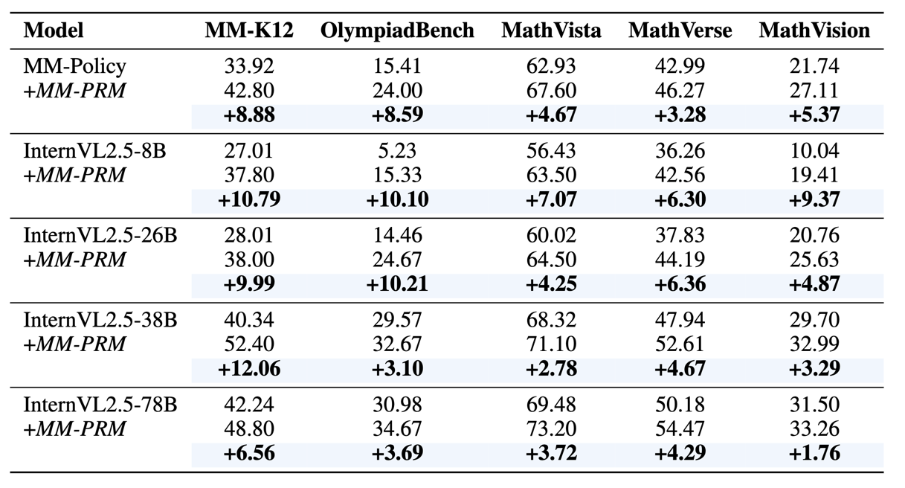

<div align="center">
    
</div>

<div align="center">

# MM-PRM

</div>

<div align="center">
<p align="center">
  📖<a href="https://arxiv.org/abs/2505.13427">Paper</a> |
  📊<a href="https://huggingface.co/datasets/Cierra0506/MM-K12">MM-K12</a> |
  🤗<a href="https://huggingface.co/Cierra0506/MM-PRM">MM-PRM</a>
</p>
</div>

<hr>
<div align="center">
<p style="text-align: center;">MM-PRM: Enhancing Multimodal Mathematical Reasoning with Scalable Step-Level Supervision<p>
</div>
<hr>

## 🎯Overview

While Multimodal Large Language Models (MLLMs) have achieved impressive progress in vision-language understanding, they still struggle with complex multi-step reasoning, often producing logically inconsistent or partially correct solutions. A key limitation lies in the lack of fine-grained supervision over intermediate reasoning steps. To address this, we propose **MM-PRM**, a process reward model trained within a fully automated, scalable framework. We first build **MM-Policy**, a strong multimodal model trained on diverse mathematical reasoning data. Then, we construct **MM-K12**, a curated dataset of 10,000 multimodal math problems with verifiable answers, which serves as seed data. Leveraging a Monte Carlo Tree Search (MCTS)-based pipeline, we generate over 700k step-level annotations without human labeling. The resulting PRM is used to score candidate reasoning paths in the Best-of-N inference setup and achieves significant improvements across both in-domain (MM-K12 test set) and out-of-domain (OlympiadBench, MathVista, etc.) benchmarks. Further analysis confirms the effectiveness of soft labels, smaller learning rates, and path diversity in optimizing PRM performance. MM-PRM demonstrates that process supervision is a powerful tool for enhancing the logical robustness of multimodal reasoning systems. We release all our codes and data at [MM-PRM](https://github.com/ModalMinds/MM-PRM).

## 🗞️ News

- **\[2025/05/19\]** We released `MM-PRM`.
  - 📖 Paper: [MM-PRM-Paper](https://arxiv.org/abs/2505.13427)
  - 📊 Data: [MM-K12](https://huggingface.co/datasets/Cierra0506/MM-K12)
  - 🤗 Model: [MM-PRM](https://huggingface.co/Cierra0506/MM-PRM)

## 📊 MM-K12 Dataset

We released **MM-K12** dataset at [MM-K12](https://huggingface.co/datasets/Cierra0506/MM-K12).

## 🤖 Models

<div align="center">
    
</div>

*Figure 1 | Qualitative example of MM-PRM accurately identifying error steps in multimodal reasoning process.*

<div align="center">
    
</div>

*Figure 2 | Performance improvements across various benchmarks when applying the MM-PRM to different models.*

- 🤗 [MM-PRM](https://huggingface.co/Cierra0506/MM-PRM)

## 🏁 Getting Started

### 📦 Installation

```shell
git clone https://github.com/ModalMinds/MM-PRM.git
cd MM-PRM
pip install -r requirements.txt

# install flash-attn==2.3.6:

pip install flash-attn==2.3.6 --no-build-isolation

# Alternatively you can compile from source:

git clone https://github.com/Dao-AILab/flash-attention.git
cd flash-attention
git checkout v2.3.6
python setup.py install
```

### 📂 Data Pipeline

1. **Seed dataset preparation**

   To begin, prepare a seed dataset consisting of verifiable problems. Each example should be formatted as a JSON object containing the following fields:

   ```json
   [
       {
           "id": "unique identifier for the problem",
           "question": "problem statement",
           "correct_answer": "ground-truth final answer for evaluation and verification",
           "image_path": "/path/to/image.png"
       },
       ...
   ]
   ```

   This dataset will be used as input to the data pipeline to generate annotated solution trees with step-wise correctness labels.

   To enable parallel data generation, you need to split the seed dataset into smaller chunks.

   ```shell
   cd data_pipeline
   python process_json.py
   ```

2. **API endpoint setup (Optional)**

   The data generation process requires an API endpoint to automatically verify whether the final answer in a rollout is correct. You can deploy a model (e.g., Qwen2.5) locally to act as the answer judge.

   We recommend using [vLLM](https://docs.vllm.ai/) to deploy a local model.

3. **Run data pipeline**

   Once you have all set, you can run the data pipeline to generate step-level supervision data.

   Before running, ensure that all necessary parameters are correctly set in the script or passed through the environment.

   ```shell
   sh run_data_pipeline.sh
   ```

4. **Sampling Training Data from annotation trees**

   After generating annotated reasoning trees, you need to sample step-by-step solution paths from these trees to construct the training data for the Process Reward Model (PRM). This can be done using the script:

   ```shell
   python traverse.py
   ```

   The next step is to convert this data into the format required for PRM training. Use the following script to perform the formatting:

   ```shell
   python prm_data_format.py
   ```

### 🌐 Start PRM Training

Create a JSON file in `internvl_chat/shell/data/`

The format for the JSON file should be:

```json
{
  "your-custom-prm_dataset": {
    "root": "/path/to/the/image/root",
    "annotation": "/path/to/the/jsonl/annotation",
    "data_augment": false,
    "repeat_time": 1,
    "length": "number of samples in the dataset"
  }
}
```

Once the dataset configuration is in place, you can start training the PRM model with:

```shell
GPUS=8 sh shell/internvl2.5/2nd_finetune/internvl2_5_38b_dynamic_res_2nd_finetune_full_prm.sh
```

### 📊 Evaluation

We provide our **evaluation code** in the `eval/` directory.

## ⭐ Starchart

[](https://star-history.com/#ModalMinds/MM-PRM&Date)

## 🤝 Contribution

If you want to contribute, please feel free to make a pull request or create an issue.

Please refer to `CONTRIBUTING.md` before you dive in！

## 📬 Contact

If you have any questions or would like to engage with our community, feel free to scan the QR code below to join our WeChat group.

<div align="center">

</div>

## 🎓 Acknowledgements

We acknowledge the outstanding open-source contributions from [OpenR](https://github.com/openreasoner/openr) and [vLLM](https://github.com/vllm-project/vllm). We also extend our gratitude to [InternVL](https://github.com/OpenGVLab/InternVL) for their open-source techniques and base models, which have enabled us to further our exploration.

## 📜 Citation

```
@article{du2025mmprm,
      title={MM-PRM: Enhancing Multimodal Mathematical Reasoning with Scalable Step-Level Supervision},
      author={Lingxiao Du and Fanqing Meng and Zongkai Liu and Zhixiang Zhou and Ping Luo and Qiaosheng Zhang and Wenqi Shao},
      year={2025},
      journal={arXiv preprint arXiv:2505.13427},
}
@article{meng2025mmeureka,
      title={MM-Eureka: Exploring the Frontiers of Multimodal Reasoning with Rule-based Reinforcement Learning},
      author={Fanqing Meng and Lingxiao Du and Zongkai Liu and Zhixiang Zhou and Quanfeng Lu and Daocheng Fu and Tiancheng Han and Botian Shi and Wenhai Wang and Junjun He and Kaipeng Zhang and Ping Luo and Yu Qiao and Qiaosheng Zhang and Wenqi Shao},
      year={2025},
      journal={arXiv preprint arXiv:2503.07365},
}
@article{liu2025cpgd,
      title={CPGD: Toward Stable Rule-based Reinforcement Learning for Language Models},
      author={Zongkai Liu and Fanqing Meng and Lingxiao Du and Zhixiang Zhou and Chao Yu and Wenqi Shao and Qiaosheng Zhang},
      year={2025},
      journal={arXiv preprint arXiv:2505.12504},
}
```
